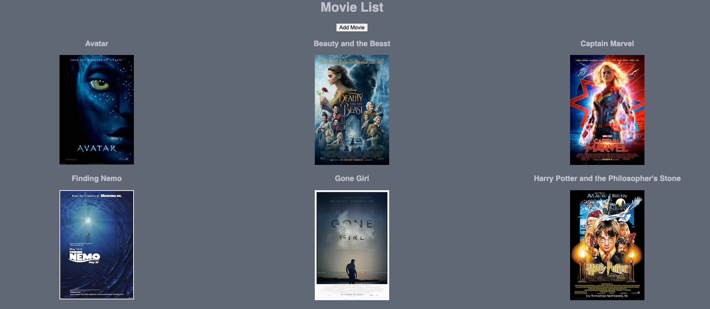
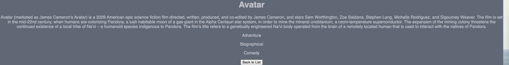

# Movie Sagas

## Description

For this project I built movie library. The home page is a list of the current movies available, when a movie is clicked on the user is brought to a page with a description of the film. The home page also has an add movie button which brings the user to a page where they can input a new movie using the fields available(title, image url, description, and genre - the list of genres is pulled down from the database). We sagas on this project to help avoid race conditions. Overall the project was a success, the greatest challenge was figuring out how to target the selected film and display the corresponding information on a new page. 

Tech used:

* React
* Redux
* HTML
* CSS
* javaScript
* Node.js
* SQL 

### Home Page
 
### Details Page
 
### Add Movie Page
 

## Thank You

I would like to give a special shoutout to dEv Jana and my other instructors at Prime Academy for teaching me the skills and creating the requirements for this project. 